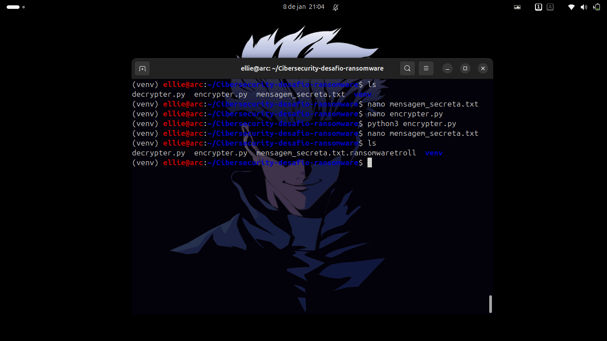
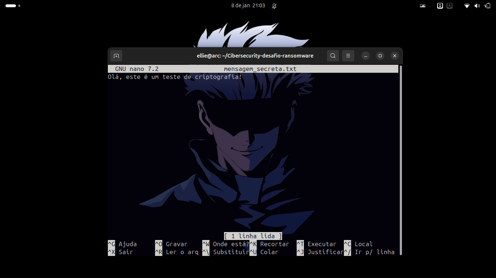
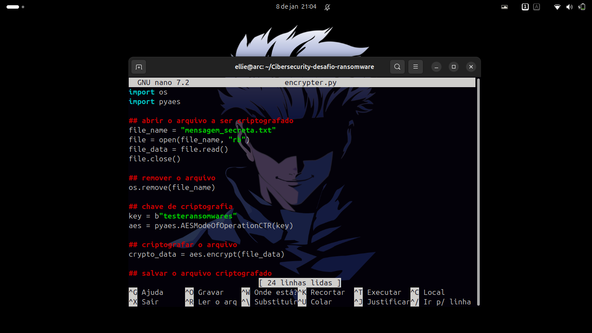
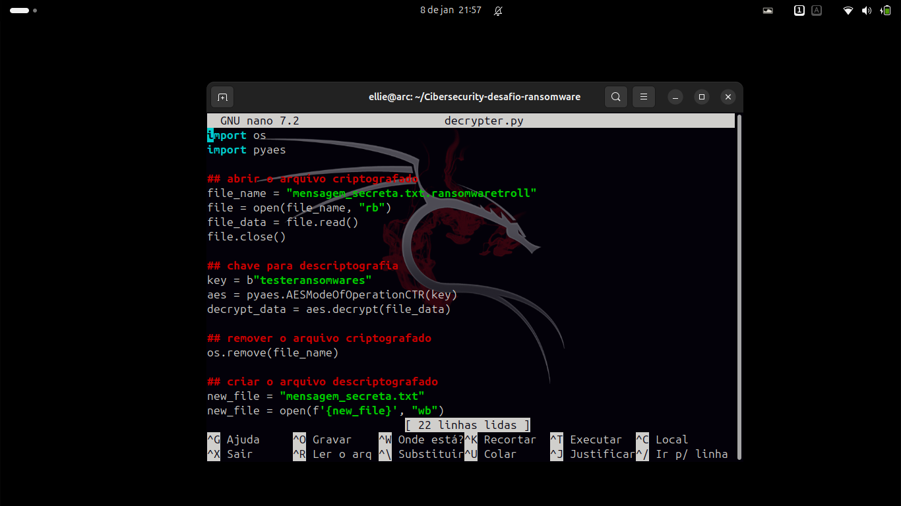
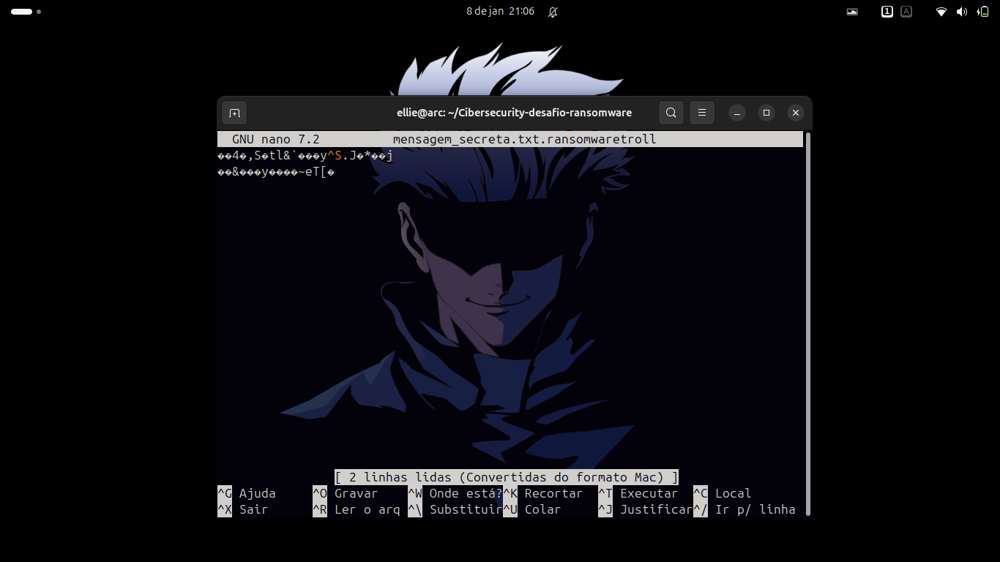

# Desafio Ransomware - Fork Personalizado

Este repositório é um fork do projeto original [Desafio Ransomware](https://github.com/cassiano-dio/cibersecurity-desafio-ransomware), adaptado por [Ellen](https://github.com/ellen-xploit/Cibersecurity-desafio-ransomware) como parte de um desafio do curso de cibersegurança.

O objetivo é demonstrar como criptografar e descriptografar um arquivo de texto usando Python, simulando o funcionamento de um ransomware.

---

## 📚 Conteúdo

1. [Modificações Realizadas](#-modificações-realizadas)
2. [Estrutura do Projeto](#-estrutura-do-projeto)
3. [Como Executar](#-como-executar)
4. [Capturas de Tela](#-capturas-de-tela)
5. [Conceitos Aprendidos](#-conceitos-aprendidos)
6. [Aviso Legal](#-aviso-legal)
7. [Contribuição](#-contribuição)
8. [Uso](#-uso)

---

## 🚀 Modificações Realizadas


Neste fork, as seguintes alterações foram implementadas:

- **Arquivo de Texto Único**: `mensagem_secreta.txt` armazena a mensagem original>
- **Criptografia e Descriptografia**:
  - `encrypter.py` criptografa o arquivo.
  - `decrypter.py` descriptografa o arquivo.
- **Capturas de Tela**: Incluídas para documentar o processo.
- **Uso do `venv`**: Ambiente virtual Python para isolar dependências.

---

## 📂 Estrutura do Projeto

- `mensagem_secreta.txt`: Arquivo de texto.
- `encrypter.py`: Script de criptografia.
- `decrypter.py`: Script de descriptografia.
- `README.md`: Arquivo principal.
- **Capturas de Tela**:
  - `comandos.png`, `arquivodetexto.png`, `encrypter.png`, `decrypter.png`, `ar>

---

## 🛠️ Como Executar

1. **Configure o ambiente**:
   - Crie e ative um ambiente virtual:
     ```bash
     python3 -m venv venv
     source venv/bin/activate  # Linux/Mac
     venv\Scripts\activate     # Windows
     ```
   - Instale as dependências:
     ```bash
     pip install cryptography
     ```

2. **Execute os scripts**:
   - Criptografar:
     ```bash
     python encrypter.py
     ```
   - Descriptografar:
     ```bash
     python decrypter.py
     ```

---

## 📸 Capturas de Tela

- **Comandos**: 
- **Arquivo Original**: 
- **Código do Encrypter**: 
- **Código do Decrypter**: 
- **Arquivo Criptografado**: 

---

## 📚 Conceitos Aprendidos

- Criptografia e descriptografia.
- Segurança de dados.
- Uso de ambientes virtuais (`venv`).


---

## ⚠️ Aviso Legal

Este projeto é **apenas para fins educacionais**. Não use para atividades maliciosas.


---

## 🤝 Contribuição

1. Faça um fork.
2. Crie uma branch:
   ```bash
   git checkout -b minha-feature

---

## 📄 Uso

# Uso Livre para Fins de Estudos

Este repositório contém um projeto desenvolvido para fins educacionais. O código e os arquivos aqui presentes são livres para uso, cópia, modificação e compartilhamento, desde que seja para fins de aprendizado e estudo.

## 🚫 Restrições

- **Não use este projeto para atividades maliciosas ou ilegais**.
- Respeite a finalidade educacional do projeto.

## 🙌 Contribuições

Se você quiser contribuir com melhorias ou correções, sinta-se à vontade para abrir uma issue ou enviar um pull request.

---

Feito com ❤️ por [Ellen](https://github.com/ellen-xploit)  
Baseado no projeto de [Cassiano Dio](https://github.com/cassiano-dio/cibersecurity-desafio-ransomware)
